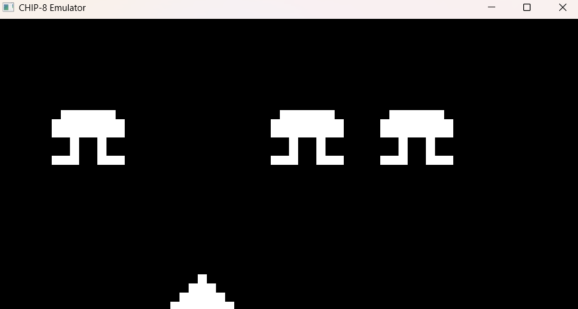

# CHIP-8 Emulator (Interpreter)




A high-performance, cycle-accurate CHIP-8 emulator written in C++17. Designed for efficiency and memory safety, it accurately simulates the execution patterns of 1970s hardware while using SDL3 for modern, hardware-accelerated rendering.

While many implementations rely on heavy object-oriented abstractions, this interpreter treats C++ as a high-level assembler. My implementation utilizes contiguous memory blocks and bounds-checking to achieve high execution speeds while maintaining memory safety against malformed ROMs.

## Features

* **Complete Instruction Set:** All 34 standard CHIP-8 opcodes implemented, tested, and validated.
* **O(1) Opcode Dispatch:** Zero-overhead execution routing utilizing a switch-case system.
* **Fixed-Timestep Main Loop:** CPU cycles execute unthrottled (or at a fixed multiplier), while Delay and Sound timers are strictly decoupled to a synchronous 60 Hz loop.
* **CRT Phosphor Rendering:** Custom frame-buffer decay matrix to mitigate native XOR sprite flickering, simulating vintage CRT ghosting.
* **Hardware-Accelerated Display:** SDL3 streaming texture with nearest-neighbor scaling for mathematically perfect pixel preservation.
* **Memory Safety:** Hardened boundary checks prevent stack overflow/underflow and out-of-bounds RAM access.

## Architecture

The emulator is designed around a flat, memory-contiguous structure. Rather than splitting the hardware into disparate classes, the entire system state is packed into a single `Chip8` class to maximize CPU cache locality.

### Memory
The system RAM is a flat `std::array<uint8_t, 4096>`. 
* `0x000` to `0x1FF`: Reserved for system execution. The 80-byte hexadecimal fontset is loaded into `0x050–0x09F` at initialization.
* `0x200` to `0xFFF`: Program memory. The `loadROM()` function enforces a strict `< 3584` byte size limit before writing to memory, preventing buffer overruns.

### CPU & Registers
The CPU houses 16 general-purpose 8-bit registers (`V0`–`VF`), a 16-bit index register (`I`), and the Program Counter (`PC`). The stack is implemented as a fixed `std::array<uint16_t, 16>` manipulated by an 8-bit stack pointer (`sp`). `VF` is strictly reserved as the flag register for ALU carries, borrows, and sprite collision detection.

### Display Engine
The display relies on a 64x32 linear frame-buffer (`std::array<uint32_t, 2048>`). 
Drawing operations (`DXYN`) use byte-level bitwise XOR logic. If a lit pixel is toggled off, `VF` is set to 1 (collision). During the SDL3 render pass, inactive pixels are not cleared instantly; instead, their brightness is mathematically decayed per frame to simulate CRT phosphor trails.

### Input Keypad
Input is handled via a 16-key boolean state array (`bool keypad[16]`). The SDL3 event loop polls hardware keystrokes and updates this array synchronously. CPU instructions `EX9E`, `EXA1`, and `FX0A` query this array directly without blocking the main thread (unless `FX0A` intentionally halts the `PC`).

## Execution Pipeline

This emulator utilizes a raw Fetch-Decode-Execute pipeline for cache efficiency.

1. **Fetch:** The CPU reads two sequential bytes from memory at the `PC` and merges them into a single 16-bit `opcode` via bitwise shifts. The `PC` is immediately incremented by 2.
2. **Decode & Execute:** The engine isolates the highest nibble using a bitwise AND mask (`opcode & 0xF000u`). This routes the instruction into a primary `switch` block.
3. **ALU Routing:** For dense opcode categories (like the `0x8000` ALU arithmetic block or the `0xF000` memory operations), a nested `switch` isolates the lowest nibble (`opcode & 0x000Fu`), resulting in instantaneous, hardware-like execution. 

## Memory Safety Measures

Because this engine does not use type safe abstractions, memory safety is achieved algorithmically. The engine is guarded against malicious or buggy ROMs:
* **Stack Checks:** `00EE` (Return) drops the instruction if `sp == 0`. `2NNN` (Call) drops the instruction if `sp >= 16`. This prevents the stack pointer from wrapping and accessing out-of-bounds host memory.
* **Index Protection:** During `DXYN` (Draw) and `FX55/FX65` (Register Load/Store), the `I` register is bounds-checked. If `I + offset >= 4096`, the execution loop breaks, preventing segmentation faults.


## Building the Emulator

This project relies on **SDL3** for hardware-accelerated video and input polling.

### Windows (MinGW Direct Compile)
```bash
g++ src/main.cpp src/chip8.cpp -o chip8_emu.exe -I include -I <path_to_SDL3_include> <path_to_SDL3_bin>/SDL3.dll
```

### Linux / macOS (CMake)
```bash
mkdir build
cd build
cmake ..
make
```

## Input Mapping & Constants

### Keyboard Layout
| CHIP-8 Keypad | Modern Keyboard |
| :---: | :---: |
| `1` `2` `3` `C` | `1` `2` `3` `4` |
| `4` `5` `6` `D` | `Q` `W` `E` `R` |
| `7` `8` `9` `E` | `A` `S` `D` `F` |
| `A` `0` `B` `F` | `Z` `X` `C` `V` |

### Hardware Constants
| Constant | Value | Description |
| :--- | :--- | :--- |
| `RAM` | `4096` | Total virtual memory footprint (bytes) |
| `WIDTH` | `64` | Native internal screen width |
| `HEIGHT` | `32` | Native internal screen height |
| `ROM_OFFSET` | `0x200` | Standard entry point for software |
| `TIMER_HZ` | `60` | Fixed decrement rate for Delay/Sound |

## Usage
Launch the executable and pass the path to a ROM file via the command line:
```bash
./chip8_emu roms/SpaceInvaders.ch8
```
## Acknowledgment
A massive thank you to **Tobias Langhoff**. This emulator was built by following his [Guide to making a CHIP-8 emulator](https://tobiasvl.github.io/blog/write-a-chip-8-emulator/),a fantastic resource to get started with emulators.